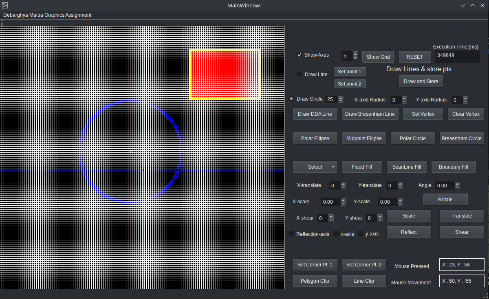
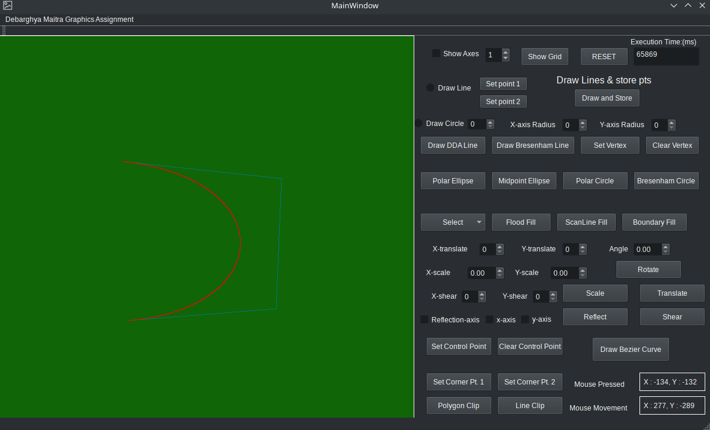

# Graphics Application

- A Qt-based application that implements all basic graphics algorithms.

## Brief Overview:

- `Line Drawing Algorithms`: DDA, Bressenham algorithms.
- `Circle Drawing Algorithms`: Polar, Bressenham algorithms.
- `Ellipse Drawing Algorithms`: Polar, Bressenham Mid-point algorithms.
- `Filling Algorithms`: Scan-line Fill, Flood Fill, Boundary Fill algorithms.
- `Transformation Algorithms`: Shift, Scale, Shear, Rotate, etc.
- `Clipping`: Line and Polygon clipping algorithms.
- `Bezier Curve`: Bezier Curve of 3rd order implementation with control points.

## Demo:
- The following figure shows the demo of the application with circle drawing and filling performed: 

- The following figure shows the demo of the application with bezier curve: 

## Test:
- You can test and use the application(bound to linux (Qt-based) users) by downloading from the releases section.
- OR, if you have qmake/qt installed you can build by configuring the `Graphics-Application.pro` file.

## Contibuting:
- Contributions for implementing any other algorithms/ optimizing the existing ones are very much welcome and would be greatly appreciated!
